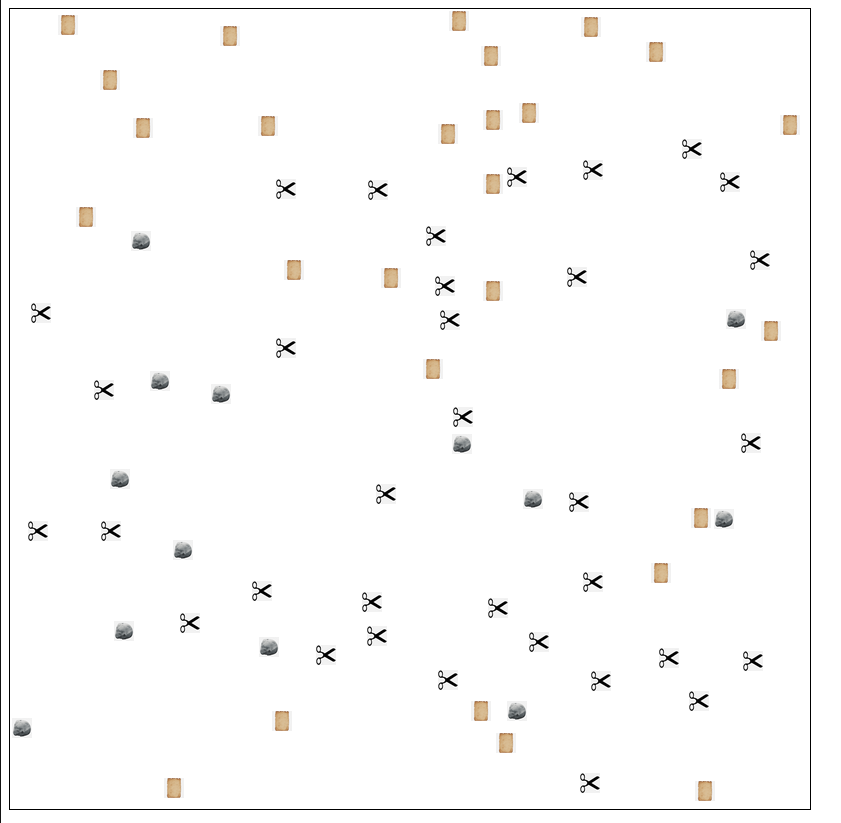

# Rock Paper Scissors animation

## What is it

Runs and animation of rock paper scissors. 

Each team starts with 25 players. The players move around randomly until one team is victorious. 

Just clone the repo and go to <file:///path/to/your/directory/index.html>

## To Do

- [ ] Crop the images around the object
- [ ] Display victory message and stop animation when all players are one type
- [ ] Some collisions arent changing the losing object
- [ ] Slow it down a bit to make the bouncing animations a bit smoother
- [ ] Crashes when left for a while- 
- [ ] When one team has no players left it crashes
